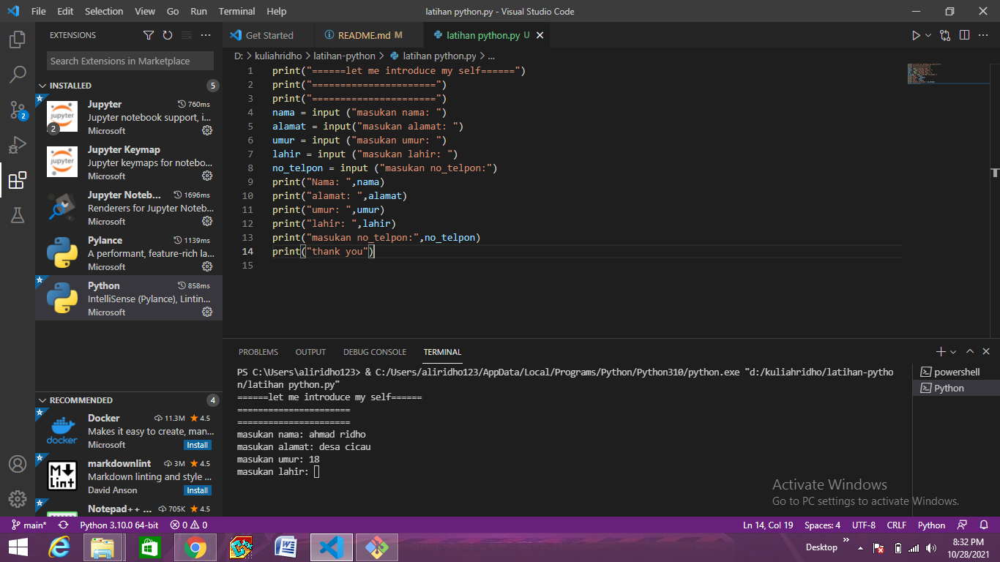
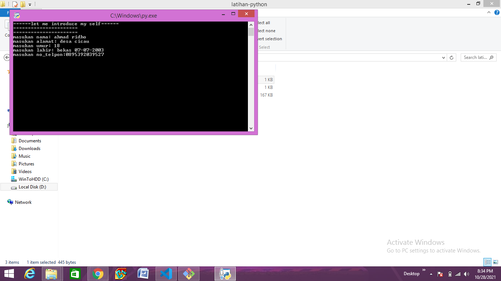
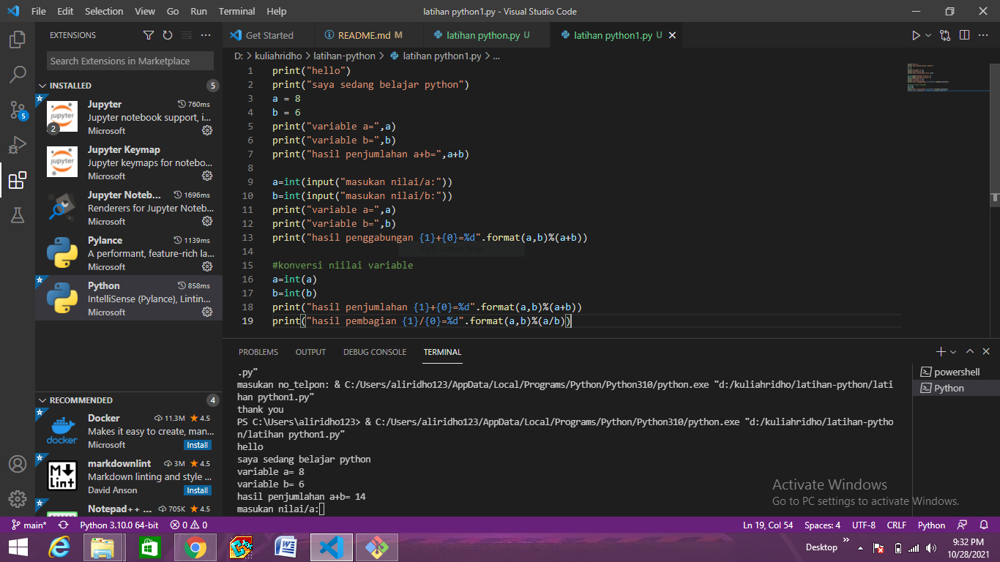

# latihan-python
## nama:ahmad ridho
## nim:312110279

untuk membuat biodata, ketik script seperti berikut

 kemudian klik run

 maka hasil nya seperti ini

# #membuat program pembagian dan penjumlahan

 ketik script seperti di bawah ini

 maka hasil akan seperti ini

 kemudian klik run

